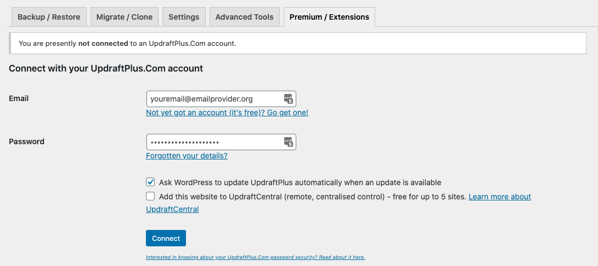
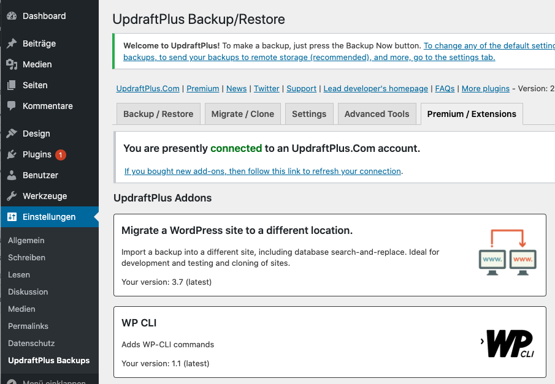

# DDEV pull-wp

⚠️ Status: Experimental, use at own risk 👷‍♀️⚠️

## Description

Scared wordpress updates will break your wordpress site? Not anymore. Use the open source tool DDEV with updraftplus addons, test updates beforehand in a local dev enviroment - without breaking anything on the live website. This repository contains a preconfigured DDEV with custom commands.

## Prerequisites

- DDEV installed on local machine
- License for updraftplus CLI and updraftplus Migrator (for local DDEV)
- SSH and rsync on remote server/webspace (not all webspaces support this)
- [Remote sites only need the free version of updraftplus plugin, but it is better to install it via .zip as well from https://updraftplus.com/support/installing-updraftplus-premium-your-add-on/]

## Install

1. **Clone this repository, open folder in terminal**

2. **Install fresh wordpress locally**

    ```shell
    ddev install-wp
    ```

    (This command will automatically install wordpress and activate the .zip file need to activate updraftplus for addons (See: https://updraftplus.com/support/installing-updraftplus-premium-your-add-on/). At the end of the installation, you will be prompted for an admin password.)
    
    [Use `ddev launch` to open the local site directly in browser]

3. **Login into local wordpress**

    Login to https://pull-wp.ddev.site/wp-admin/ with user "admin" and your chosen password.

4. **Activate updraftplus CLI and Migrator add-on ($)** 

    Activate paid license for updraftplus CLI and Migrator / premium in updraftplus dashboard with updraftplus account:

    https://pull-wp.ddev.site/wp-admin/options-general.php?page=updraftplus

    

    

    (See: https://updraftplus.com/support/installing-updraftplus-premium-your-add-on/)

## Pull a remote site

1. **Install updraftplus (free) on remote wordpress site**

    On the remote install updraftplus free, it's best to use .zip file as well from here: https://updraftplus.com/support/installing-updraftplus-premium-your-add-on/ - but you don't have to activate/connect anything.

2. **Create backup on remote site**

    Just create a backup with "backup now" and standard settings.

3. **Pull remote site backup and restore(migrate) it**
  
    ```shell
    ddev pull-wp sshusername@host.xyz /html/wordpress
    ```
    
    This command connects to the remote live website via SSH, rsync's the backup files to local DDEV, restores it with help of updraftplus Migrator and CLI. You need to provide SSH information and path to wordpress installation on remote server.

4. **Open and test updates locally**

    Open `https://pull-wp.ddev.site`
    
    The login credentials are now the values from the live website. You can now test an update in peace and without breaking the live website.
     
    [A good practice could be to use tools like Disable Emails, WP Debug Bar, etc.]

5. **Run updates on live website**

    If the update works locally, you could just do the same on your live website. 

## Reset

    <This part is work in progress>
    
1. **Reactivate CLI and Migrator addon on local DDEV**
    
    After a restore process you need to activate the updraftplus CLI again in WP dashboard unfortunately. Otherwise you'll get "Error: 'updraftplus' is not a registered wp command". It is helpful to have connected your live website with your updraft credentials as well, otherwise you'll need to re-enter them & activate the addons again. (TODO: Is there a workaround for this?)

2. **Delete transferred backups**

    ```shell
    ddev delete-backups
    ```
    
3. **Start with ddev pull-wp again**

## Full/hard reset
  
    Drop database datables and remove wordpress/-directory:
    ```shell
    ddev delete-wp
    ```
    If you need to remove other non-tracked files:
    (Caution: also deletes ignored files + symlinked-/ folders)
    
    ```shell
    git clean -fdx
    ```
    Delete complete DDEV containers:
    
    ```shell
    ddev delete -O
    ```
    
    If you made changes to DDEV files from this git repo, which you want to delete: 
    
    ```
    git reset --hard`
    ```
  
## Advanced

### Local PHP/MySQL version

See .ddev/config.yaml to change the local docker enviroment to be similiar to your remote webspace/server. You can also use nginx instead of apache.

### Working with git?

If you have a theme checked out with git on remote website, this will be transferred to the local enviroment. Updratfplus does not delete .git folders while migration.

### Forgot password?

Run following command:

```shell
ddev exec wp user update admin --prompt=user_pass --path=wordpress/
```

### Symlink plugin/themes in fresh wp

Beware: Experimental

1. Clone a theme or plugin via git into symlinked-themes/ or symlinked-plugins/

2. Setup symlink

This will delete wp-content/themes/mychild-theme and replace it with symlink:

```shell
ddev setup-symlink theme mychild-theme
```

See ".ddev/commands/web/setup-symlink" for details.

## Challenges

1. Updraftplus configuration is overwritten on restore, activated CLI and Migrator plugin need to be activated again (this is kind of annoying if you want to pull the next website)